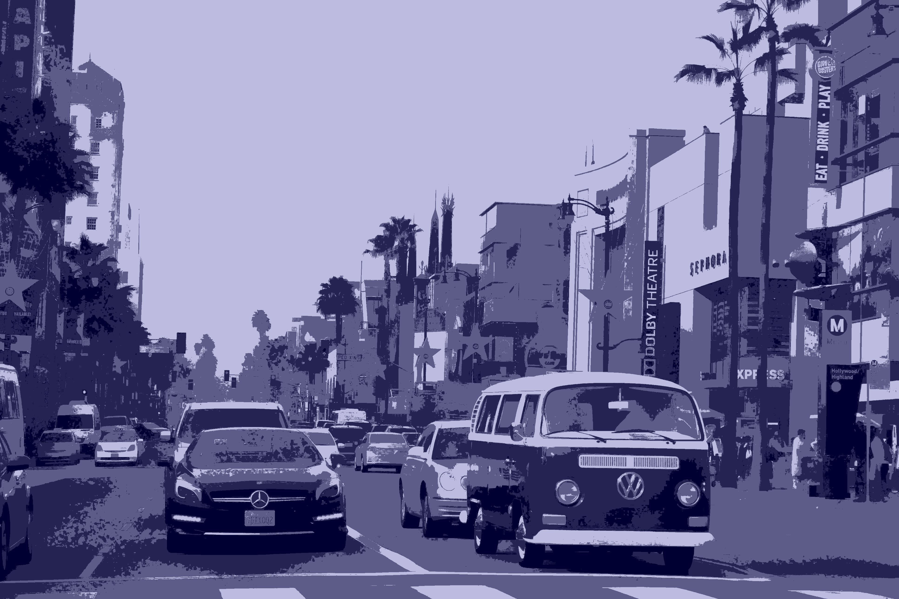
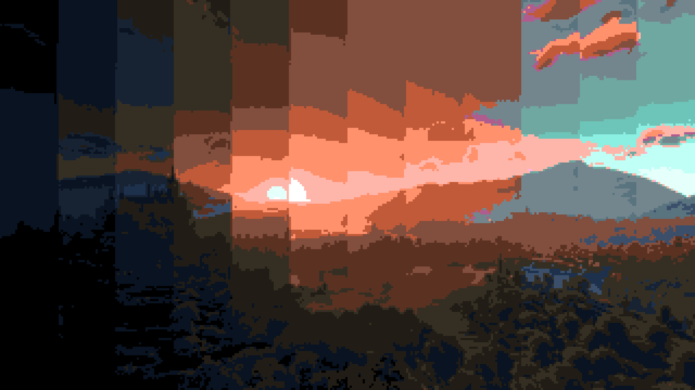

# Blockvideo Studio
Blockvideo Studio is a CLI program to convert images, directories of images, and videos into Blockimages / Blockvideos, images and videos made up of 'blocks' (other individual images), by replacing each pixel in an image or video with another image.

# Examples
https://imgur.com/5yeBVeM from [u/zlakphoto](https://www.reddit.com/user/zlakphoto/)

Using the `examples/cold_palette/` directory for blocks, with a scale factor of 1, we get this output:

---

https://i.redd.it/v6i2u32nxu751.jpg from [u/matiorex](https://www.reddit.com/user/Matiorex/)

Using the `examples/25_palette/` directory for blocks, with a scale factor of 6 and a modified block size of 6, we get this output:

---
https://i.redd.it/u5p5b3twe3251.jpg from [u/Yoredlol](https://www.reddit.com/user/Yoredlol/)

Using the `examples/nature_animals` directory for blocks, with a scale factor of 50, the block size is 50 (50x50 resolution images), and we get this output:

# Prerequisites
1. Python 3.12* and PIP
2. FFmpeg

\* older versions may work, but haven't been tested

# Setup
1. Install requirements: `pip install -r requirements.txt`
2. Run the CLI program: `python .\main.py`
