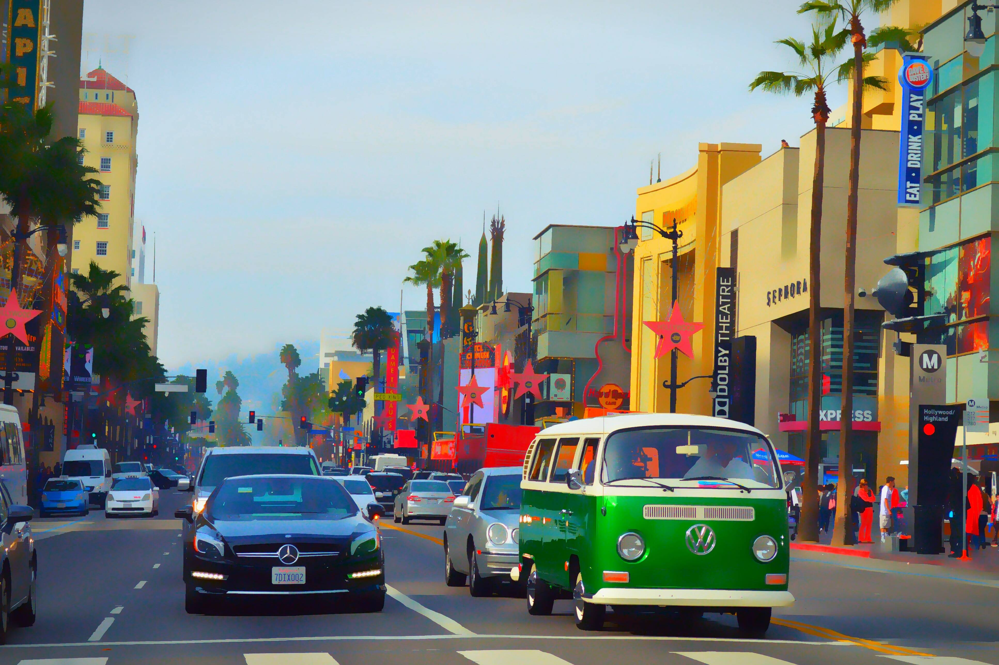

# Blockvideo Studio
Blockvideo Studio is a CLI program to convert images, directories of images, and videos into Blockimages / Blockvideos, images and videos made up of 'blocks' (other individual images), by replacing each pixel in an image or video with another image.

# Examples
https://imgur.com/5yeBVeM from [u/zlakphoto](https://www.reddit.com/user/zlakphoto/)

Block Directory: `examples/nature_animals` (Split up iOS/MacOS Emojis)  
Block Size: 50 (50x50 images)  
Scale Factor: 50

---
https://i.redd.it/u5p5b3twe3251.jpg from [u/Yoredlol](https://www.reddit.com/user/Yoredlol/)

Blocks directory: `examples/POLA5` (Source: https://lospec.com/palette-list/pola5)  
Block Size: 4  
Scale Factor: 4

---

https://archive.org/details/bliss-600dpi from [Charles O'Rear](https://archive.org/search?query=creator%3A%22Charles+O%27Rear%22)

Blocks Directory: `examples/Win95` (Source: https://lospec.com/palette-list/windows-95-256-colours)  
Block Size: 50  
Scale Factor: 60

# Prerequisites
1. Python 3.12* and pip
2. FFmpeg

\* older versions may work, but haven't been tested

# Setup
1. Install requirements: `pip install -r requirements.txt`
2. Run the CLI program: `python .\main.py` or `py .\main.py`

\* Note: all configuration is done in the CLI's prompts.

# ChatGPT Generated Documentation
I write garbage, barely functional code, not books. So, I had ChatGPT generate ~~95% of the code~~ 100% of the following documentation for me.  
I mean, I had to proofread it, but it seems good enough :)

## Usage
To use Blockvideo Studio, run the main() function. The program will prompt you for the required inputs:

**Reference Loader Block Directory**: The path to the directory containing the reference images (blocks) used for conversion.  
**Allow Transparency**: Whether or not to consider transparent pixels in the reference images.  
**Scale Factor**: A divisor for scaling the input image or video. A higher scale factor reduces the resolution of the output, increasing the size of each block.

Following the initial configuration, the program offers a menu with options to convert single *images*, *directories*, or *videos*, and to adjust the configuration settings.

## Functions and Classes (Code Explanation)

**Converting Content**:
For single images or directories, you'll need to specify the input and output paths. The program supports progress visualization.  
For videos, specify the input and output paths, and the temporary directory for frame extraction. The conversion process includes options for memory management and parallel processing.

The program is structured around several key functions and classes, each serving a distinct purpose in the conversion process:

### Compilation: save_video
Saves a sequence of images as a video file, optionally adding an audio track. It sorts the images by filename, initializes a video writer using OpenCV, writes frames to the video, and uses ffmpeg to add audio.

### Data Retrieval: get_fps, get_audio
These functions extract the frames per second (FPS) rate and the audio track from a given video file, respectively.

### Extraction: video_to_frames
Converts a video file into individual frames, saving them to a specified directory. It supports selecting a subset of frames and adjusting their scale.

### Block Image Generation: BlockImageGenerator
A class that generates a block image from a reference image. It loads the input image, optionally resizes it, and then replaces each pixel or block of pixels with the closest matching block from a set of reference images.

### Reference Loading: ReferenceLoader
Loads and processes a directory of reference images (blocks) to be used for creating block images. It calculates average colors for each block and prepares a nearest neighbor search tree for efficient matching.

### Miscellaneous Functions: plot_times
A placeholder function for future implementations, intended for plotting or analyzing time-related data.

### Processing Functions
Includes functions for converting single images, directories of images, and video files into block-style visuals. These functions use the BlockImageGenerator class and support dynamic conversion settings to optimize performance and memory usage (for directories and videos).

### Running Functions
Provides interactive prompts for the user to specify paths, scale factors, and other parameters for the conversion tasks. These functions facilitate the use of the tool without modifying the source code directly.